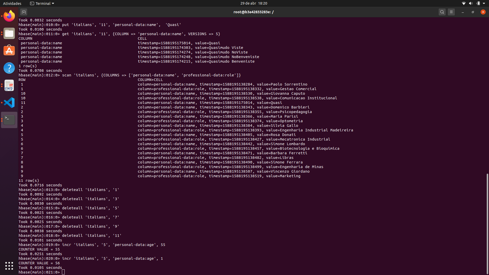

# HBase
FURB - Pós Data Science - Banco de Dados não Relacional - HBase

## Configurações

Subindo container do mongo: `docker run --name hbase-furb dajobe/hbase`.

Acessar o bash do container: `docker exec -it hbase-furb bash`.

Para acessar o shell do banco: `hbase shell`.

## Exercício 1 - Aquecendo com alguns dados

Copiar o arquivo para o container: `docker cp italians.txt hbase-furb:/tmp`.

### 1.1. Crie a tabela com 2 famílias de colunas personal-data e professional-data.
`create 'italians', 'personal-data', 'professional-data'`

### 1.2. Importe o arquivo via linha de comando.
`hbase shell /tmp/italians.txt`

### 2.1. Adicione mais 2 italianos mantendo adicionando informações como data de nascimento nas informações pessoais e um atributo de anos de experiência nas informações profissionais.
```
put 'italians', '11', 'personal-data:name',  'Quasimodo Benveniste'
put 'italians', '11', 'personal-data:birth_date',  '1988-10-25'
put 'italians', '11', 'professional-data:years_exp',  '10'
put 'italians', '12', 'personal-data:name',  'Eterie Paradiso'
put 'italians', '12', 'personal-data:birth_date',  '2020-04-29'
put 'italians', '12', 'professional-data:years_exp',  '0'
```

### 2.2. Adicione o controle de 5 versões na tabela de dados pessoais.
`alter 'italians', NAME => 'personal-data', VERSIONS => 5`

### 2.3. Faça 5 alterações em um dos italianos.
```
put 'italians', '11', 'personal-data:name',  'Quasimudo Benveniste'
put 'italians', '11', 'personal-data:name',  'Quasimudo NoBenveniste'
put 'italians', '11', 'personal-data:name',  'Quasimudo NoViste'
put 'italians', '11', 'personal-data:name',  'Quasimudo Viste'
put 'italians', '11', 'personal-data:name',  'Quasi'
```

### 2.4. Com o operador get, verifique como o HBase armazenou o histórico.
`get 'italians', '11', {COLUMN => 'personal-data:name', VERSIONS => 5}`

### 2.5. Utilize o scan para mostrar apenas o nome e profissão dos italianos.
`scan 'italians', {COLUMNS => ['personal-data:name', 'professional-data:role']}`

### 2.6. Apague os italianos com row id ímpar.
```
deleteall 'italians', '1'
deleteall 'italians', '3'
deleteall 'italians', '5'
deleteall 'italians', '7'
deleteall 'italians', '9'
deleteall 'italians', '11'
```

### 2.7. Crie um contador de idade 55 para o italiano de row id 5.
`incr 'italians', '5', 'personal-data:age', 55`

### 2.8. Incremente a idade do italiano em 1.
`incr 'italians', '5', 'personal-data:age', 1`

### Evidência
