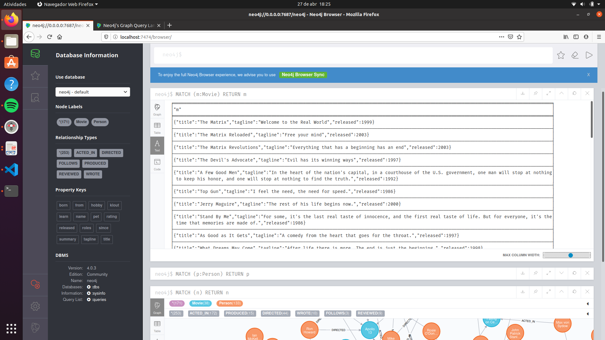
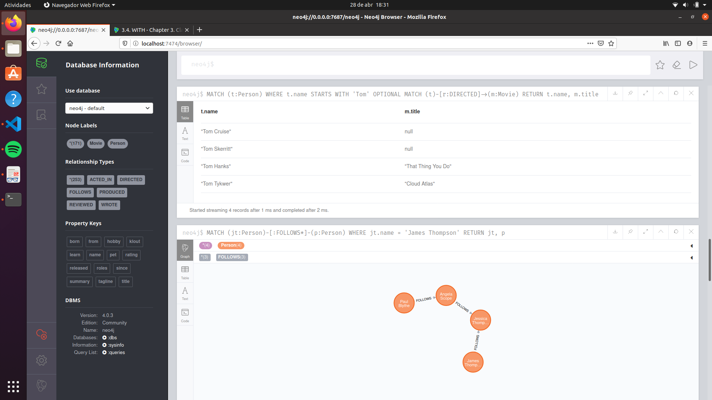
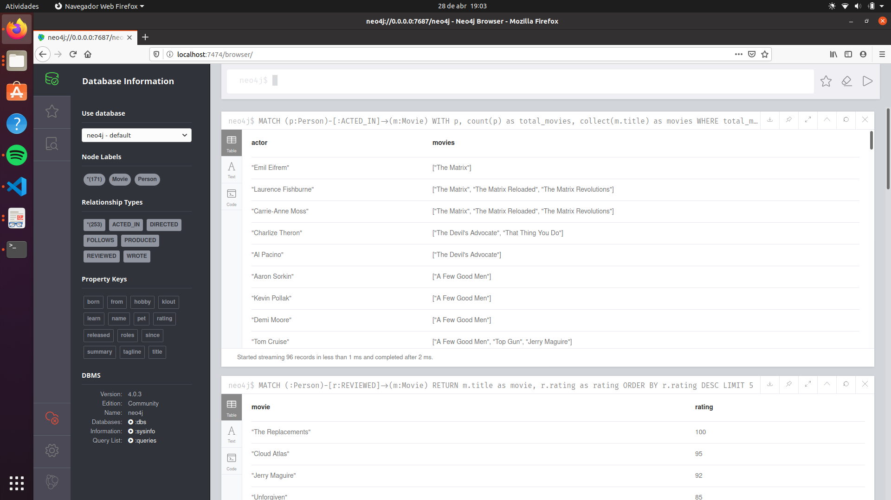

# Neo4j
FURB - Pós Data Science - Banco de Dados não Relacional - Neo4j

## Configurações

Subindo container do Neo4j: `docker run --name neo4j-furb --publish=7474:7474 --publish=7687:7687 --volume=$HOME/neo4j/data:/data --env=NEO4J_AUTH=none neo4j:4.0`.

Acessar o Neo4j via browser: `http://localhost:7474`.

Na tela inicial do Neo4j, selecionar a opção "No authentication" e clicar em Connect.

No editor, executar o comando `:play movie-graph`, navegar para a seguinda página e executar o comando CREATE para criar o modelo de dados.

## Exercício 1 - Retrieving Nodes

### 1. Retrieve all nodes from the database.
`MATCH (n) RETURN n`

### 2. Examine the data model for the graph.
`CALL db.schema.visualization()`

### 3. Retrieve all Person nodes.
`MATCH (p:Person) RETURN p`

### 4. Retrieve all Movie nodes.
`MATCH (m:Movie) RETURN m`

### Evidência


## Exercício 2 - Filtering queries using property values

### 1. Retrieve all movies that were released in a specific year.
`MATCH (m:Movie {released: 2006}) RETURN m`

### 2. View the retrieved results as a table.
No painel de resultados, clicar no icone de tabela.

### 3. Query the database for all property keys.
`CALL db.propertyKeys`

### 4. Retrieve all Movies released in a specific year, returning their titles.
`MATCH (m:Movie {released: 2003}) RETURN m.title`

### 5. Display title, released, and tagline values for every Movie node in the graph.
`MATCH (m:Movie) RETURN m.title, m.released, m.tagline`

### 6. Display more user-friendly headers in the table.
```
MATCH (m:Movie) RETURN m.title AS `Title`, m.released AS `Released`, m.tagline AS `TagLine`
```

### Evidência


## Exercício 3 - Filtering queries using relationships

### 1. Display the schema of the database.
`CALL db.schema.visualization()`

### 2. Retrieve all people who wrote the movie Speed Racer.
`MATCH (p:Person)-[:WROTE]->(:Movie {title: 'Speed Racer'}) RETURN p`

### 3. Retrieve all movies that are connected to the person, Tom Hanks.
`MATCH (:Person {name: 'Tom Hanks'})--(m:Movie) RETURN m.title`

### 4. Retrieve information about the relationships Tom Hanks had with the set of movies retrieved earlier.
`MATCH (:Person {name: 'Tom Hanks'})-[rel]-(m:Movie) RETURN m.title, type(rel)`

### 5. Retrieve information about the roles that Tom Hanks acted in.
`MATCH (:Person {name: 'Tom Hanks'})-[rel:ACTED_IN]-(m:Movie) RETURN m.title, rel.roles`

### Evidência


## Exercício 4 - Filtering queries using WHERE clause

### 1. Retrieve all movies that Tom Cruise acted in.
```
MATCH (p:Person)-[:ACTED_IN]->(m:Movie)
WHERE p.name = 'Tom Cruise'
RETURN m.title
```

### 2. Retrieve all people that were born in the 70’s.
```
MATCH (p:Person)
WHERE p.born >= 1970 AND p.born <= 1979
RETURN p.name
```

### 3. Retrieve the actors who acted in the movie The Matrix who were born after 1960.
```
MATCH (p:Person)-[:ACTED_IN]->(m:Movie)
WHERE m.title = 'The Matrix' AND p.born > 1960
RETURN p.name
```

### 4. Retrieve all movies by testing the node label and a property.
```
MATCH (m)
WHERE m:Movie AND m.released = 2003
RETURN m.title
```

### 5. Retrieve all people that wrote movies by testing the relationship between two nodes.
```
MATCH (p)-[r]->(m)
WHERE p:Person AND type(r) = 'WROTE' AND m:Movie
RETURN p.name
```

### 6. Retrieve all people in the graph that do not have a property.
```
MATCH (p:Person)
WHERE NOT exists(p.born)
RETURN p.name
```

### 7. Retrieve all people related to movies where the relationship has a property.
```
MATCH (p:Person)-[r]->(m:Movie)
WHERE exists(r.rating)
RETURN p.name, m.title, r.rating
```

### 8. Retrieve all actors whose name begins with James.
```
MATCH (p:Person)-[r]->(:Movie)
WHERE type(r) = 'ACTED_IN' AND p.name STARTS WITH 'James'
RETURN p.name
```

### 9. Retrieve all REVIEW relationships from the graph with filtered results.
```
MATCH (:Person)-[r]->(m:Movie)
WHERE type(r) = 'REVIEWED' AND toLower(r.summary) CONTAINS 'fun'
RETURN m.title, r.summary
```

### 10. Retrieve all people who have produced a movie, but have not directed a movie.
```
MATCH (p:Person)-[:PRODUCED]->(m:Movie)
WHERE NOT ((p)-[:DIRECTED]->(:Movie))
RETURN p.name, m.title
```

### 11. Retrieve the movies and their actors where one of the actors also directed the movie.
```
MATCH (p1:Person)-[:ACTED_IN]->(m:Movie)<-[:ACTED_IN]-(p2:Person)
WHERE exists((p2)-[:DIRECTED]->(m))
RETURN m.title, p1.name AS `Actor`, p2.name AS `Director`
```

### 12. Retrieve all movies that were released in a set of years.
```
MATCH (m:Movie)
WHERE m.released in [2000, 2004, 2008]
RETURN m.title, m.released
```

### 13. Retrieve the movies that have an actor’s role that is the name of the movie.
```
MATCH (p:Person)-[r:ACTED_IN]->(m:Movie)
WHERE m.title in r.roles
RETURN m.title, p.name
```

### Evidência


## Exercício 5 - Controlling query processing

### 1. Retrieve data using multiple MATCH patterns.
```
MATCH (g:Person)-[:ACTED_IN]->(m:Movie)<-[:DIRECTED]-(d:Person), (a:Person)-[:ACTED_IN]->(m)
WHERE g.name = 'Gene Hackman'
RETURN m.title as movie, d.name AS Director , a.name AS `Actors`
```

### 2. Retrieve particular nodes that have a relationship.
```
MATCH (jt:Person)-[:FOLLOWS]-(p:Person)
WHERE jt.name = 'James Thompson'
RETURN jt, p
```

### 3. Modify the query to retrieve nodes that are exactly three hops away.
```
MATCH (jt:Person)-[:FOLLOWS*3]-(p:Person)
WHERE jt.name = 'James Thompson'
RETURN jt, p
```

### 4. Modify the query to retrieve nodes that are one and two hops away.
```
MATCH (jt:Person)-[:FOLLOWS*1..2]-(p:Person)
WHERE jt.name = 'James Thompson'
RETURN jt, p
```

### 5. Modify the query to retrieve particular nodes that areconnected no matter how many hops are required.
```
MATCH (jt:Person)-[:FOLLOWS*]-(p:Person)
WHERE jt.name = 'James Thompson'
RETURN jt, p
```

### 6. Specify optional data to be retrieved during the query.
```
MATCH (t:Person)
WHERE t.name STARTS WITH 'Tom'
OPTIONAL MATCH (t)-[r:DIRECTED]->(m:Movie)
RETURN t.name, m.title
```

### 7. Retrieve nodes by collecting a list.
```
MATCH (a:Person)-[:ACTED_IN]->(m:Movie)
RETURN a.name as actor, collect(m.title) as movies
```

### 8. Retrieve all movies that Tom Cruise has acted in and the co-actors that acted in the same movie by collecting a list
```
MATCH (t:Person)-[:ACTED_IN]->(m:Movie)<-[:ACTED_IN]-(a:Person)
WHERE t.name = 'Tom Cruise'
RETURN m.title as movie, collect(a.name) as co_autors
```

### 9. Retrieve nodes as lists and return data associated with the corresponding lists.
```
MATCH (p:Person)-[:REVIEWED]->(m:Movie)
RETURN m.title AS movie, count(p) AS total_reviewers, collect(p.name) AS reviewers
```

### 10. Retrieve nodes and their relationships as lists.
```
MATCH (d:Person)-[:DIRECTED]->(:Movie)<-[:ACTED_IN]-(a:Person)
RETURN d.name AS director, count(a) as total_actors, collect(a.name) as actors
```

### 11. Retrieve the actors who have acted in exactly five movies.
```
MATCH (a:Person)-[:ACTED_IN]->(m:Movie)
WITH a, count(a) as total_movies, collect(m.title) as movies
WHERE total_movies = 5
RETURN a.name as actor, movies
```

### 12. Retrieve the movies that have at least 2 directors with other optional data.
```
MATCH (m:Movie)
WITH m, size((:Person)-[:DIRECTED]->(m)) as total_directors
WHERE total_directors >= 2
OPTIONAL MATCH (r:Person)-[:REVIEWED]->(m)
RETURN m.title as movie, r.name as reviewers
```

### Evidência


## Exercício 6 - Controlling results returned

### 1. Execute a query that returns duplicate records.
```
MATCH (p:Person)-[:ACTED_IN]->(m:Movie)
WHERE m.released >= 1990 AND m.released <= 1999
RETURN m.released, m.title, collect(p.name)
```

### 2. Modify the query to eliminate duplication.
```
MATCH (p:Person)-[:ACTED_IN]->(m:Movie)
WHERE m.released >= 1990 AND m.released <= 1999
RETURN m.released, collect(m.title), collect(p.name)
```

### 3. Modify the query to eliminate more duplication.
```
MATCH (p:Person)-[:ACTED_IN]->(m:Movie)
WHERE m.released >= 1990 AND m.released <= 1999
RETURN m.released, collect(DISTINCT m.title), collect(p.name)
```

### 4. Sort results returned.
```
MATCH (p:Person)-[:ACTED_IN]->(m:Movie)
WHERE m.released >= 1990 AND m.released <= 1999
RETURN m.released, collect(DISTINCT m.title), collect(p.name)
ORDER BY m.released DESC
```

### 5. Retrieve the top 5 ratings and their associated movies.
```
MATCH (:Person)-[r:REVIEWED]->(m:Movie)
RETURN m.title as movie, r.rating as rating
ORDER BY r.rating DESC
LIMIT 5
```

### 6. Retrieve all actors that have not appeared in more than 3 movies.
```
MATCH (p:Person)-[:ACTED_IN]->(m:Movie)
WITH p, count(p) as total_movies, collect(m.title) as movies
WHERE total_movies <= 3
RETURN p.name as actor, movies
```

### Evidência
