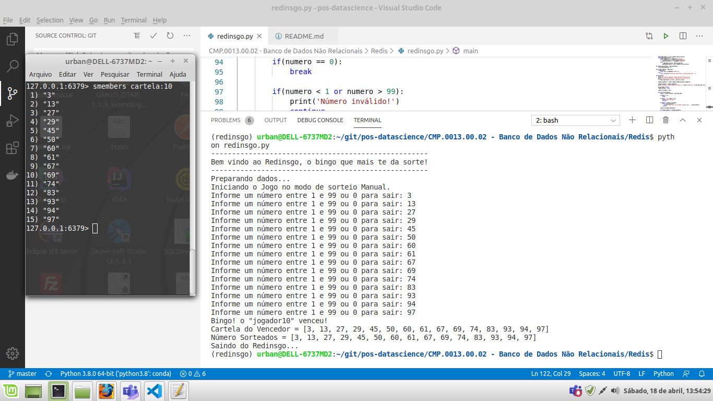

# Redis
FURB - Pós Data Science - Banco de Dados não Relacional - Redis

## Dependências
- Docker
- Conda
- Python

## Configurações
Execute o comando `conda env create -f environment.yaml` para criar o ambiente com as dependências.

Execute o comando `conda activate redinsgo` para ativar o ambiente.

(Opcional) Para remover o ambiente, execute o comando `conda remove --name redinsgo --all`

## Utilização
1. Execute `docker-compose up` para subir os serviços.

2. Execute `python redinsgo.py` para rodar a aplicação.

O jogo permite dois parâmetros:
`--n-jogadores` para definir a quantidade de jogadores (default é 50)
`--modo-auto` para definir se o sorteio será no modo automático (default é False)

Exemplo: `python redinsgo.py --n-jogadores 10 --modo-auto True`

## Evidências

### Testando no modo de sorteito manual

### Testando no modo de sorteiro automático
